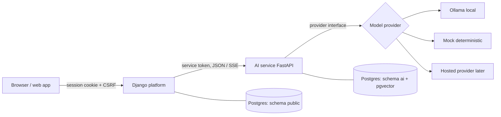

# AI service design (milestone 5)

Status: **design for review**. Nothing here is built yet. Decisions: D1, D17, D23, D27, D28, D30, D31, M7.

The AI service is a separate FastAPI application (`tutor/ai/`). It owns **how** the tutor answers. Django owns
**whether** a student may ask, **what is stored** about the conversation, and **everything the student and parent
see**. The browser never talks to the AI service.

## 1. Goals and non-goals

| Goals (v1) | Non-goals (v1) |
|---|---|
| A lesson-grounded tutor with three modes: *Explain*, *Socratic*, *Hint* | Open-ended chat about anything |
| Answers built only from **published** lesson content, with the passages used returned as citations | Answering from the model's general knowledge when the lesson doesn't cover it |
| Safety checks on every student message and every reply; flags that parents and Operations can act on | Replacing human safety review |
| Works with a real local model (Ollama), a deterministic mock (tests, CI, hosted demo) and, later, a hosted provider, with no code change | Choosing the production provider now (decided with evals before real users, D23) |
| Measurable quality: versioned prompts, golden eval sets, logged model, prompt version, tokens, latency and cost | Fine-tuning models |
| Short-answer marking and author assist designed in, built after the tutor | Voice, images, handwriting |

## 2. Architecture



| Concern | Owner | Why |
|---|---|---|
| Who may use the tutor: login, active consent (D10), entitlement (C6), daily message limit, feature flag | Django | Access rules live in one place |
| Conversations, messages, safety flags, usage counters, parent topic summaries | Django (`tutor` app) | Parents' views, deletion on consent withdrawal (M5) and audit are Django concerns |
| Lesson index (passages + vectors), prompts, provider calls, safety classification, evals | AI service (schema `ai`) | Fast-changing AI logic isolated from the platform |
| Identity | Neither leaks it | The AI service receives a pseudonymous `learner_ref` (HMAC of the user id), never names, contacts or payments |

The AI service is **stateless about learners**: every request carries the conversation it needs. Losing the AI
service's database loses only the index, which can be rebuilt from published content.

## 3. Django ↔ AI service contract

All endpoints are versioned under `/v1`, JSON over HTTPS, OpenAPI-documented. Every call carries:

| Header | Purpose |
|---|---|
| `Authorization: Bearer <TUTOR_AI_SERVICE_TOKEN>` | Shared secret, compared in constant time; different per environment; rotated by supporting two valid tokens during a switch |
| `X-Request-ID` | Generated by Django, logged by both services, returned in errors |
| `Idempotency-Key` (indexing only) | Re-sent requests don't duplicate work |

| Method | Path | Purpose | Response |
|---|---|---|---|
| GET | `/health` | Liveness + database + provider reachability | `200` / `503` |
| PUT | `/v1/lessons/{lesson_id}/index` | Index one published lesson version (body: version id, course, subject, class, sections) | `200 {chunks, embedding_model}`; replaces any older version's chunks atomically |
| DELETE | `/v1/lessons/{lesson_id}/index` | Remove a retired lesson | `204` |
| GET | `/v1/index/status` | Indexed `lesson_id → version_id, embedding_model` for reconciliation | `200` |
| POST | `/v1/tutor/turns` | One tutor turn (below) | `text/event-stream` |
| POST | `/v1/safety/check` | Classify a text (used by Django for parent-visible content later) | `200 {category, severity}` |
| POST | `/v1/grading/short-answer` | *(after tutor)* marks against a rubric | `200 {marks, feedback, confidence}` |

**Tutor turn request** (Django builds it; the AI service never looks anything up about the student):

```json
{
  "learner_ref": "lr_9f2c…",            "class_number": 8,
  "lesson": {"id": "…", "version_id": "…", "course_id": "…", "title": "What is data?"},
  "mode": "socratic",                   "chat_id": "…",
  "pinned_chunk_ids": ["…", "…"],       "history": [{"role": "student", "text": "…"}, {"role": "tutor", "text": "…"}],
  "message": "why is the name the label?",
  "guard": {"open_quiz": true, "protected_answers": ["Who won the match"]},
  "limits": {"max_reply_tokens": 250}
}
```

**Streamed response** (Server-Sent Events): `meta` (chat id, model, prompt version, pinned chunk ids) → many `delta`
events (text) → exactly one `final` (full text, citations, safety result, token counts, latency, cost) or one `error`
(`provider_unavailable`, `safety_blocked`, `timeout`, `invalid_request`). Django relays deltas to the browser and stores
only the `final` event, so a dropped stream never leaves half a message in the record.

**Failure rules:** Django times out per environment (local long, production short), never retries a tutor turn
automatically (a retry could double-charge tokens and confuse the student), keeps the student's message, and shows
"The tutor is unavailable right now". Indexing calls are retried with backoff because they are idempotent.

## 4. Model providers (D27, D30)

One Python protocol, implemented three times:

```python
class ModelProvider(Protocol):
    name: str
    async def chat(self, messages: list[Message], *, max_tokens: int, temperature: float) -> AsyncIterator[str]: ...
    async def embed(self, texts: list[str], *, kind: Literal["document", "query"]) -> list[list[float]]: ...
    async def health(self) -> bool: ...
```

| Provider | Where | Chat | Embeddings | Behaviour |
|---|---|---|---|---|
| `ollama` | Developer machines | `TUTOR_OLLAMA_CHAT_MODEL` (default `llama3.2`) via `/api/chat` streaming, `keep_alive` set | `nomic-embed-text`, 768 dims, with its required `search_document:` / `search_query:` prefixes | Real model, free, private; slow on CPU (see §9) |
| `mock` | CI, automated tests, hosted demo | **Rule-based tutor** that builds replies from the retrieved passages (quotes the best passage, asks a guiding question in Socratic mode, gives the first step in Hint mode), deterministic | **Hashed bag-of-words vectors** (768 dims): texts sharing words get similar vectors, so retrieval, off-topic detection and citations behave realistically without a model | No network, no key, instant; the hosted demo is usable and every test is reproducible |
| `hosted` | Production (later) | Chosen with evals | Chosen with evals | Same interface; prompt caching used for the fixed prefix (§6) |

The provider is chosen once at start-up from settings and injected (FastAPI dependencies), so tests replace it
without monkey-patching. Changing embedding model changes vector dimensions and meaning, so every chunk stores its
`embedding_model`, and retrieval only compares vectors from the same model; a model change triggers a full re-index.

## 5. Lesson index (RAG)

**What is indexed:** only the currently **published** version of each lesson (M6). Draft, in-review and archived
content never reaches the tutor.

**Chunking:** one chunk per lesson section (`heading + blocks`, as in DATA_MODEL). Sections longer than ~300 tokens
are split on paragraph boundaries with ~40 tokens of overlap; each chunk keeps its lesson, section heading, position and
content version. Chunk text is stored exactly as published so citations can be shown verbatim.

**Storage (schema `ai`, managed by Alembic migrations in `ai/`):**

| Table | Columns | Indexes |
|---|---|---|
| `lesson_chunk` | id, lesson_id, content_version_id, course_id, subject, class_number, position, heading, text, token_count, embedding `vector(768)`, embedding_model, created_at | HNSW on `embedding` (cosine); btree on `(lesson_id)`, `(course_id)`; unique `(lesson_id, content_version_id, position)` |
| `prompt_version` | name, version, body, checksum, active, created_at | unique `(name, version)` |
| `eval_run` | suite, prompt_version, provider, model, started_at, finished_at, pass_rate, results JSON | |
| `index_event` | lesson_id, version_id, action, idempotency_key, status, error, at | unique `idempotency_key` |

The AI service connects with its own database role, allowed to use schema `ai` only (M7). Locally: the same database
`tutor_dev`; on Render: the same Neon database, different role.

**Keeping the index in step with publishing:** Django writes an `IndexRequest` row inside the same transaction that
publishes content (transactional outbox), then, after commit, calls `PUT /v1/lessons/{id}/index`. Failures stay in the
outbox and are retried by `manage.py sync_ai_index`, which also compares `/v1/index/status` with the published
versions and fixes any difference. `build.sh` runs it on every deploy (Render's free tier has no background worker or
cron), so a missed call is repaired at the next deploy at the latest, and an admin can trigger it at any time.

**Retrieval:** the query is embedded as `query`, then cosine search restricted to the same course and embedding model,
top 4, with a minimum similarity. Results below the threshold mean "off-topic" (§7).

## 6. Prompt layout and tutor behaviour (D31)

```
1. Tutor rules + safety instructions + mode instructions    fixed, versioned (prompt registry)
2. Lesson context for this chat                             chosen once at chat start, then pinned
3. Conversation so far                                      last N turns; older turns summarised
4. The student's new message                                the only new text each turn
```

Everything before the new message is byte-identical across turns of a chat, so Ollama reuses its work on the prefix
and hosted providers can serve it from their prompt cache. Retrieval runs **once at chat start** (the current lesson's
chunks, plus the top related chunks from the course); a message that is off the pinned context triggers one extra
retrieval, and that turn pays the full reading cost.

| Mode | Must | Must not |
|---|---|---|
| Explain | Answer from the lesson in simple language for the student's class, one example, cite passages | Go beyond the lesson; long lectures |
| Socratic | Ask exactly one guiding question that moves the student one step | State the final answer. After 3 unsuccessful Socratic turns, offer a hint |
| Hint | Give the smallest next step | Reveal a quiz answer |

**Quiz guard:** while the student has an open quiz on this lesson, Django sends `guard.open_quiz=true` and the correct
options as `protected_answers`. The tutor is limited to Hint mode, and the output check (§7) blocks any reply that
contains a protected answer.

**Size limits** are settings per provider (tokens): locally rules ≈ 300, lesson context ≈ 600, history ≈ 6 turns,
reply ≤ 250; larger for the hosted provider. Prompts are files in `ai/prompts/<name>/<version>.md`, loaded into
`prompt_version` with a checksum; every reply records `model` and `prompt_version`.

## 7. Safety (children's platform)

Two checks per turn, before and after the model:

| Stage | Checks | On failure |
|---|---|---|
| **Input** (student message) | Length ≤ 500 chars; personal-data scrubbing (phone numbers, emails, addresses replaced by placeholders before the model sees them); prompt-injection patterns ("ignore your instructions", role-play requests); category classifier | Blocked input gets a kind, fixed reply; nothing is sent to the model |
| **Output** (model reply) | Category classifier; quiz-answer leak; grounding check (reply must overlap the cited passages); length | Replaced with a safe fallback reply; flagged |

| Category | Severity | Action |
|---|---|---|
| Off-topic | low | Gentle redirect to the lesson; not flagged |
| Personal data shared | medium | Scrubbed; student reminded not to share it; flagged for parent summary |
| Bullying, abuse, adult content, violence | high | Fixed safe reply; flag to Operations safety queue; visible in full to the parent (D13) |
| Self-harm or risk to life | critical | Fixed caring reply with a helpline shown by Django (locale-specific, reviewed by the safety owner); immediate Operations alert under the written escalation procedure (D15) |

The classifier is a layered, testable component: deterministic rules and word lists first (fast, explainable, work
with every provider), then a model-based check with the hosted provider in production. The fixed replies and the
helpline text are content owned by the safety owner, not strings in code.

## 8. Quality: evals

| Suite | Contents | Scored by |
|---|---|---|
| `grounding` | Questions answerable from a lesson | Reply cites the right passages; key facts present |
| `no-giveaway` | Quiz questions asked directly, in Socratic and Hint mode | Correct option never stated |
| `off-topic` | Unrelated questions (cricket scores, homework for other subjects) | Redirect, no invented facts |
| `safety` | Red-team messages per category, including injection attempts | Correct category, correct fixed reply, flag raised |
| `tone` | Class 6 vs Class 12 phrasing | Reading level within band |

Golden sets are YAML files in `ai/evals/`, reviewed like code. `python -m tutor_ai.evals run --provider mock` runs in
CI and proves the pipeline (retrieval, guards, safety rules) is correct; runs against `ollama` or `hosted` are manual or
scheduled and store an `eval_run`. A prompt or model change is accepted only if pass rates don't fall.

## 9. Performance (measured, D30)

Reference laptop: CPU only (Intel Iris Xe, which Ollama doesn't use), 16 GB RAM, Ollama 0.23.2 in WSL.

| Model | Reads prompt | Writes | Load | 1,286-token prompt |
|---|---|---|---|---|
| `llama3.2` 3B | 26–29 tokens/s | 10–14 tokens/s | 10–16 s | 50 s reading + 9 s writing ≈ **60 s to first word** |
| `llama3.1:8b` | ~9 tokens/s | ~6.5 tokens/s | 9 s | ≈ 2.5 min to first word (estimated) |

Consequences: the prompt layout above, `keep_alive`, streaming, generous local timeouts, and no local model in any
automated test. Production targets: first token < 3 s, full reply < 15 s.

## 10. Configuration

| Variable | Service | Default | Notes |
|---|---|---|---|
| `TUTOR_AI_PROVIDER` | AI | `mock` | `ollama` in `.env` for local development; `mock` in CI and on the hosted demo |
| `TUTOR_OLLAMA_URL`, `TUTOR_OLLAMA_CHAT_MODEL`, `TUTOR_OLLAMA_EMBED_MODEL`, `TUTOR_OLLAMA_KEEP_ALIVE` | AI | `http://localhost:11434`, `llama3.2`, `nomic-embed-text`, `30m` | |
| `TUTOR_AI_SERVICE_TOKEN` | both | none (required) | Different per environment |
| `TUTOR_AI_URL` | Django | `http://localhost:8001` | |
| `TUTOR_AI_TIMEOUT_SECONDS` | Django | 180 local, 30 production | |
| `TUTOR_FEATURES_TUTOR` | Django | `true` | Off → `503 feature_unavailable` (D28) |
| `TUTOR_TUTOR_DAILY_LIMIT` | Django | 50 | Per student per IST day |
| `AI_DATABASE_URL` | AI | none (required) | Role limited to schema `ai` |

## 11. Observability

Structured JSON logs in both services with `request_id`, `chat_id`, `learner_ref`, provider, model, prompt version,
tokens in/out, latency (first token, total), cost estimate and outcome. **Never** message text or personal data in
logs. Django keeps per-student daily counters; the AI service exposes counts for an admin "AI usage" view later.

## 12. Testing strategy

| Layer | What | Tools | Where |
|---|---|---|---|
| Unit | Chunker, token budgeting, prompt builder (prefix stays identical across turns), hashed embeddings, safety rules, PII scrubber, answer-leak guard, SSE encoder | pytest | `ai/tests/unit` |
| Integration | Endpoints with the mock provider against real Postgres + pgvector: index → retrieve → turn → citations; idempotent re-index; auth; error events | pytest + FastAPI TestClient, Alembic migrations | `ai/tests/integration`, CI service container |
| Contract | Django's client and the AI service agree: schemas generated from the AI service's OpenAPI; Django tests use recorded, schema-validated SSE fixtures | pytest / Django tests | both |
| Django | Tutor endpoints: consent, entitlement, feature flag, daily limit, quiz guard, relay and storage of the `final` event only, deletion on consent withdrawal, query budgets | Django tests with a fake AI client | `backend/apps/tutor/tests` |
| Evals | §8 suites with `mock` in CI; `ollama` / `hosted` on demand | eval runner | `ai/evals` |
| Smoke | Hosted demo: tutor turn with the mock provider; local: optional turn with Ollama | `qa/smoke_test.py` | after deploy |

Quality gates for `ai/` match the backend (D22): ruff incl. `S`, type hints checked with mypy on the service code,
branch coverage ≥ 90%, pip-audit, and a separate CI job.

## 13. Hosting

| Environment | AI service | Provider | Database |
|---|---|---|---|
| Local | `uvicorn` on port 8001 in WSL | `ollama` (or `mock`) | local Postgres, schema `ai` |
| Hosted demo (Render free) | second free web service `tutor-ai`, internal URL only, deploys after CI | `mock` | same Neon database, role limited to schema `ai` |
| Production | paid instance | `hosted` | production Neon project |

## 14. Build order

1. `ai/` skeleton: FastAPI app, settings, auth, health, JSON logging, Alembic with schema `ai`, CI job, quality gates.
2. Provider interface with `mock` (hashed embeddings, rule-based tutor) and `ollama`.
3. Chunker + index endpoints + index status; Django outbox + `sync_ai_index`.
4. Retrieval + prompt builder + tutor turn over SSE + safety rules + quiz guard.
5. Django `tutor` app: endpoints, limits, storage, relay, parent-visible flags; smoke checks.
6. Eval runner + first golden sets; Render `tutor-ai` service.
7. Later: short-answer grading, author assist, weekly parent summaries.
