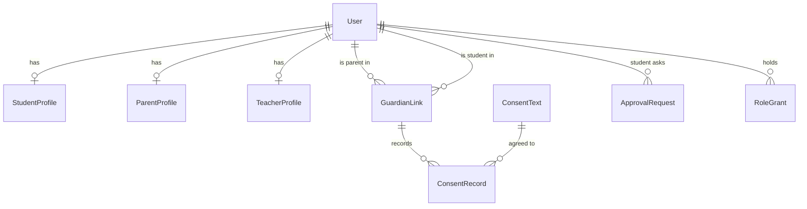
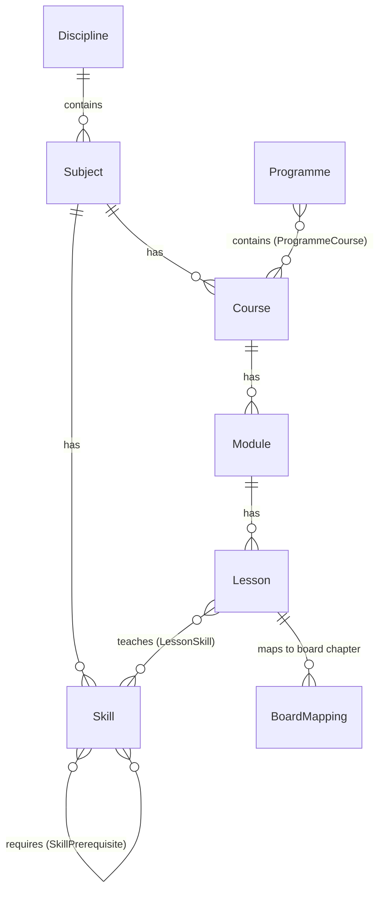

# Data model

Conventions: PostgreSQL; UUID primary keys for anything that appears in a URL, integers for internal reference data (M3);
money in integer **paise** (M4); timestamps in UTC; published content immutable (M6). Migrations live in each app's
`migrations/` folder and are checked in CI.

## Accounts and consent (`accounts`) — Implemented

| Table | Key fields | Rules |
|---|---|---|
| `User` | id (UUID), full_name, email (unique, nullable), mobile (+91…, unique, nullable), *_verified_at, account_type, is_active, deleted_at | Must have email **or** mobile (DB check); login by either |
| `StudentProfile` | class_level, board, city, school_name, status (`awaiting_consent` / `active` / `paused` / `deleted`), awaiting_since | No date of birth stored |
| `ParentProfile` | preferred_language, notify_by | |
| `TeacherProfile` | display_name, short_bio, qualifications, experience | Name + bio shown only on batch pages |
| `GuardianLink` | parent, student, relationship, is_primary, ended_at | One active primary guardian per student; one active link per pair |
| `ConsentText` | version (PK), body, effective_from | Never edited; new version instead |
| `ConsentRecord` | guardian_link, consent_text, given_at, given_ip, withdrawn_at | Evidence of consent |
| `ApprovalRequest` | student, parent_contact, channel, **token_hash**, status, send_count, expires_at, approved_by | Token stored only as SHA-256 |
| `VerificationCode` | destination, purpose, **code_hash**, expires_at, attempts, used_at | 10 minutes; 5 attempts |
| `RoleGrant` | user, role, subject?, class_level?, granted_by, revoked_at | One active grant per role and scope |

## Catalogue (`catalogue`) — Implemented

| Table | Key fields | Rules |
|---|---|---|
| `Board`, `ClassLevel`, `Discipline`, `Subject` | reference data | Loaded by `seed_reference` |
| `Course` | id, subject, class_level (empty = board-independent), slug, track, path_stage 1–5, price_paise, free_module, status | Only `published` courses are public |
| `Module`, `Lesson` | ordered by position; lesson has est_minutes | Lesson text lives in `content` |
| `Skill` | code (stable forever), name, subject, class_level | Prerequisites drive the warm-up and bridge lessons |
| `LessonSkill` | lesson, skill, role (`teaches` / `revises`) | |
| `BoardMapping` | lesson, board, class_level, chapter_ref | One lesson can map to several boards |
| `Programme`, `ProgrammeCourse` | path_stage, class_level, price_paise; ordered courses, required flag | |

## Content (`content`) — Implemented

| Table | Key fields | Rules |
|---|---|---|
| `ContentVersion` | lesson, version_no, body (JSON sections), status (draft → in_review → changes_requested / approved → published → archived), is_ai_draft, author, reviewer, published_by | One published version per lesson; reviewer ≠ author (DB-enforced); publishing archives the previous version |
| `ReviewComment` | version, author, section_ref, text, resolved_at | |

Lesson body: `{"sections": [{"heading": "…", "blocks": [{"type": "text" | "example" | "image", …}]}]}`. Each section
becomes one AI tutor chunk.

## Assessment (`assessment`) — Implemented

| Table | Key fields | Rules |
|---|---|---|
| `Question` | lesson?, skill, type (`mcq` / `short_answer`), difficulty 1–3, purpose (`quiz` / `practice` / `warmup` / `exploratory`), position | |
| `QuestionVersion` | question, version_no, body (stem, options, answer_index, explanation, hints, misconceptions), status, author, reviewer | Same rules as ContentVersion |
| `Attempt` | student, kind, lesson, started_at, submitted_at, score, max_score | Unfinished attempt is resumed |
| `AttemptItem` | attempt, **question_version**, position, hints_used | Fixed to the exact version shown |
| `Answer` | item (1:1), response, is_correct, marks, marked_by (`code` / `ai` / `teacher`) | One answer per item |

## Learner record (`learning`) — Implemented

| Table | Key fields | Rules |
|---|---|---|
| `MasteryState` | student, skill, score 0–1, evidence_count, level | Unique per student and skill |
| `MasteryEvent` | student, skill, answer, source, old_score, new_score | Explains every change |
| `LessonProgress` | student, lesson, status (`opened` / `finished`), finished_at | |
| `CourseCompletion` | student, course, completed_at, via | Counts in every programme containing the course |

## Commerce (`commerce`)

| Table | Status | Key fields | Rules |
|---|---|---|---|
| `Entitlement` | Implemented | student, product_type (`course` / `programme` / `batch`), product_id, source, starts_at, ends_at, revoked_at | The **only** table access checks read (C6); recorded courses have no end date (C7) |
| `EnrolmentRequest`, `Order`, `Payment`, `Refund` | Planned | Razorpay ids, verified_at, amount_paise, skipped courses | Entitlement created only after a verified webhook |

## Operations (`operations`)

| Table | Status | Rules |
|---|---|---|
| `AuditLog` | Implemented | Append-only; read-only in admin |
| `TutorApplication`, `SupportTicket`, `Notification`, `Event`, `Setting` | Planned | |

## Planned apps

| App | Tables |
|---|---|
| `batches` | Centre, Batch (course or programme, class, board, mode, city, centre, teacher, seats, price, status), Session (meeting link / room), Attendance |
| `tutor` (Django side) | TutorConversation, TutorMessage (mode, cited chunks, model, prompt version, tokens, cost), SafetyFlag, UsageCounter, TopicSummary |
| AI service, schema `ai` | LessonChunk (text + embedding, HNSW index), PromptVersion, EvalRun |
