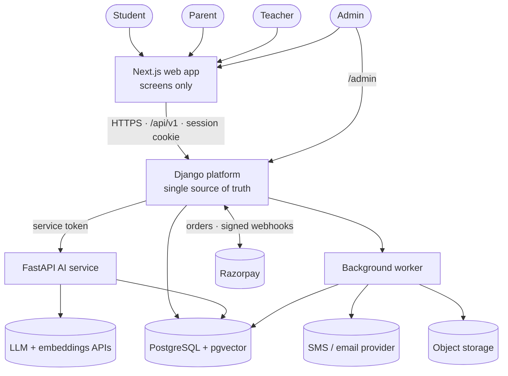

# Architecture overview

## System context



**Rules**

1. The browser talks **only** to Django. It never calls the AI service, the database or Razorpay directly.
2. Django decides *who may do what*. The AI service decides *how to answer*, and never sees names, contacts or payments.
3. Each service writes only its own tables: Django in schema `public`, the AI service in schema `ai`.

## Services

| Service | Tech | Responsibility | Status |
|---|---|---|---|
| Web app | Next.js | All screens; no business rules; API client generated from OpenAPI | Planned |
| Platform | Django 6.1, django-ninja 1.7, Python 3.12 | Accounts, consent, catalogue, content, assessment, learning, commerce, operations; REST API; admin | Implemented (core) |
| AI service | FastAPI | Tutor, retrieval (RAG), grading, practice generation, safety, evals, LLM gateway | Planned |
| Worker | Django + a job queue | Tutor indexing on publish, SMS/email, weekly reports, scheduled deletions | Planned |
| Database | PostgreSQL 16 + pgvector | All data; lesson embeddings | Implemented (local) |

## Django apps

| App | Owns | Status |
|---|---|---|
| `accounts` | User (email or mobile), profiles, guardian links, consent texts/records, approval requests, one-time codes, role grants | Implemented |
| `catalogue` | Disciplines, subjects, boards, classes, courses, modules, lessons, skills, board mappings, programmes | Implemented |
| `content` | Versioned lesson content, review comments, publishing | Implemented |
| `assessment` | Questions and their versions, attempts, attempt items, answers | Implemented |
| `learning` | Mastery states and events, lesson progress, course completion; access checks; planner | Implemented |
| `commerce` | Entitlements (orders, payments, refunds planned) | Partly implemented |
| `operations` | Audit log (tutor applications, support tickets, notifications, events planned) | Partly implemented |
| `core` | Shared error format, messaging, HTTP helpers (no tables) | Implemented |
| `batches`, `tutor` | Centres, batches, sessions, attendance; tutor conversations, safety flags, usage counters | Planned |

Inside each app: `models.py` (tables), `services.py` (business rules), `api.py` (thin endpoints), `schemas.py`
(request/response shapes), `admin.py`, `tests.py`.

## Key flows

### Parent approval

```mermaid
sequenceDiagram
    participant S as Student
    participant D as Django
    participant P as Parent
    S->>D: POST /auth/signup/student (includes parent contact)
    D->>D: create user + profile (awaiting_consent), approval request (hashed token, 7 days)
    D-->>P: SMS/email with approval link
    P->>D: POST /auth/signup/parent → verify code
    P->>D: GET /consent/link/{token} (child, class, consent text)
    P->>D: POST /consent/link/{token}/approve
    D->>D: guardian link + consent record (text version, IP) + audit log; student → active
```

### Quiz and mastery

```mermaid
sequenceDiagram
    participant S as Student
    participant D as Django
    S->>D: POST /lessons/{id}/quiz/start
    D->>D: check consent + entitlement; fix items to published question versions
    D-->>S: questions without answers
    S->>D: POST /attempts/{id}/hint (optional)
    S->>D: POST /attempts/{id}/answers
    D->>D: mark by code; credit = 1 − 0.25 × hints; update mastery; log event
    D-->>S: correct?, explanation, misconception note, new mastery
    S->>D: POST /attempts/{id}/submit
    D->>D: finish lesson; check course completion
    D-->>S: score, per-skill change, next lesson
```

### AI tutor (planned)

```mermaid
sequenceDiagram
    participant S as Student
    participant D as Django
    participant A as AI service
    S->>D: POST /tutor/lessons/{id}/messages {mode, text}
    D->>D: logged in → consent → entitlement → daily limit
    D->>A: /v1/tutor/respond (learner_ref, lesson, mode, history, weak skills)
    A->>A: safety check → retrieve lesson chunks → versioned prompt → LLM
    A-->>D: streamed text + sources, model, prompt version, tokens, cost
    D-->>S: streamed reply with cited sections; message and cost stored
```

## Environments

| Environment | Where | Database | Settings |
|---|---|---|---|
| Local | Developer machine (WSL/Linux) | Local PostgreSQL + pgvector | `config.settings.dev` via `.env` |
| CI | GitHub Actions | `pgvector/pgvector:pg16` service container | `config.settings.dev` via workflow env |
| Staging, Production | Render | Neon PostgreSQL | `config.settings.prod` via Render environment variables |
