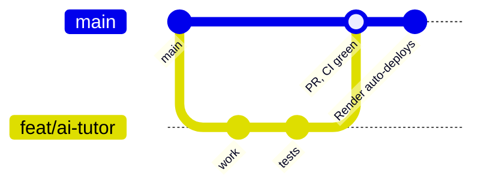

# Branches and environments

How code moves from a developer's laptop to the hosted site. Decisions D24–D29.

## Principle: one codebase, configuration decides

There is one long-lived branch, `main`, and the same code runs everywhere. What differs between a laptop, the hosted
demo and (later) production is only configuration: which AI provider answers and which key-dependent features are on.
A feature is never removed for an environment; it is switched off there.

## Branches

| Branch | Purpose | Rules |
|---|---|---|
| `main` | The only long-lived branch. Render deploys every merge | Protected: pull request required, CI must pass, stale approvals dismissed. One required approval is restored when the team joins |
| `feat/…`, `fix/…`, `docs/…`, `chore/…` | Short-lived work branches off `main`, deleted after merge | One topic per branch; tests and docs in the same PR |

## Environments

| | Local (developer machine) | Hosted demo on Render + Neon (now) | Production (at launch) |
|---|---|---|---|
| Code | any branch | `main` | `main` (a separate production service) |
| Settings | `config.settings.dev` | `config.settings.prod` | `config.settings.prod` |
| Database | Postgres + pgvector in WSL | Neon free tier, Singapore | Separate Neon project |
| AI (`TUTOR_AI_PROVIDER`) | `ollama` (real local model) | `mock` (scripted answers, no key) | `hosted` (provider chosen later) |
| Key-dependent features (`TUTOR_FEATURES_*`) | Off unless the developer has test keys | Off: clear error instead of a crash | On |
| Messages (SMS/email) | Dev outbox | Log only | Real provider |
| Data | Seeds + tester accounts | Demo catalogue, no real people's data | Real data only |
| Tester tools (`TUTOR_DEV_TOOLS`) | On | Off | Off |

## What a developer can test after cloning

Everything built so far (accounts, consent, catalogue, lessons, quizzes, mastery, Today, record, admin) and, from
milestone 5, the AI tutor against their own Ollama. Only payments and real message delivery need keys.
